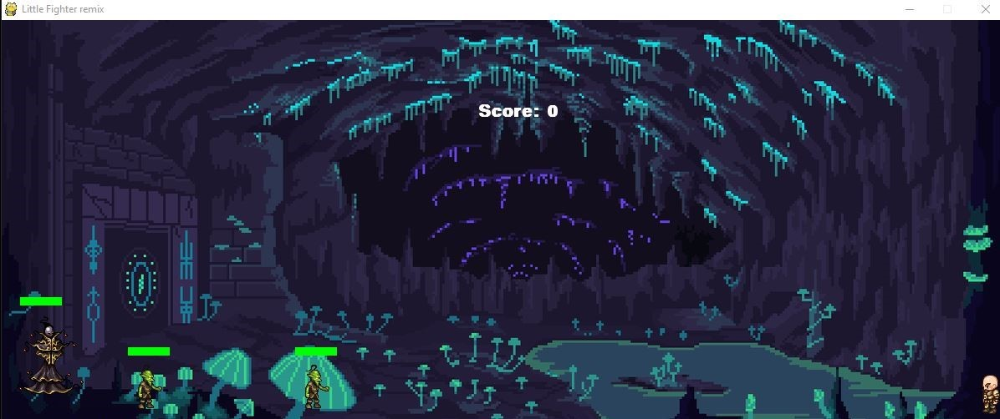

# Firstgame
Hey, this is my first game (simple game) only with python.
This game was made in 2019, it was my first time using pygame packets.

In this game, you control a hero, who wants to beat somes monsters.

<<<The game is finished, i'm a learning in shcool so you dont really have time, to finish the game.>>>

I actually made only two stages:

  - The first with a 2 goblins and 1 wizard

 
 When you beat the two goblins, the wizard start the fight with magic balls.
 To kill the wizard, you need to touche his heart ( good luck it's a little hard)
 
 When the wizard is dead, the stage 2 begin:
 

 
 In this stage, you need to touch the head of the boss, but be carefull his fire dragon can beat you haha.
 
 
